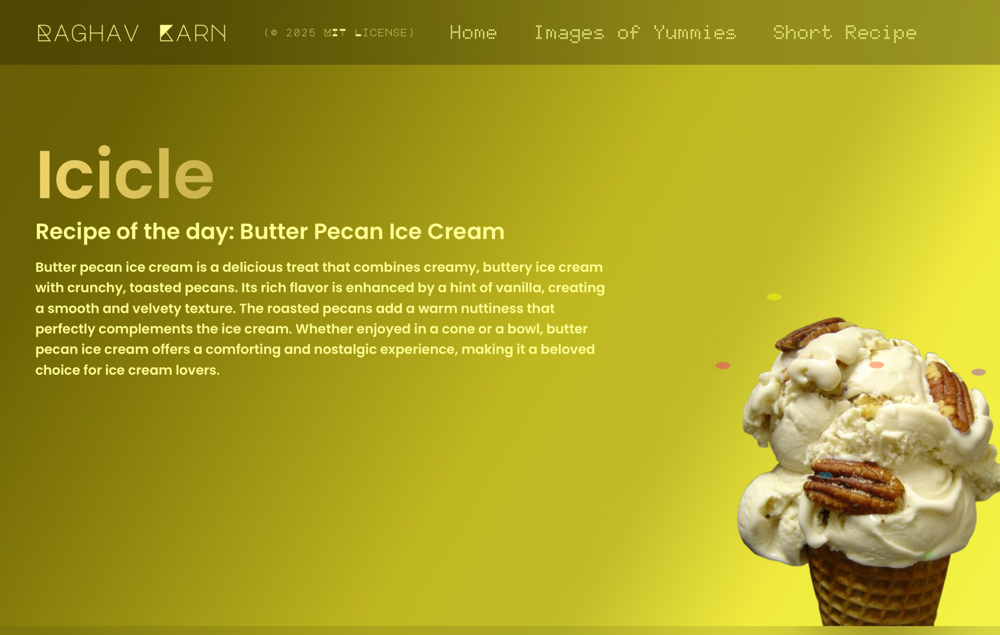

# `Icicle` (Butter Pecan Ice Cream)

Welcome to the [**Icicle**](https://icicle.raghavkarn.com)! A [Toppings](toppings.hackclub.com) project that celebrates the deliciousness of butter pecan ice cream.

## Preview

## Features

- **Delicious Recipe**: Discover unique butter pecan ice cream recipe.
- **Some Mouth-watering Images**: Enough temptation to get you going!
- **Why Butter Pecan?**: Uncover the delicousness of butter pecan ice cream and why it's a favorite among many.

## Topping's Requirements
- [x] unique (but who am I to judge)
- [x] has one (actually many) thing animated
- [x] has one (actually many) thing responsive to screen-size (although might not good look on all screens)
- [x] uses containers
- [x] has grid (in the 3 images in 2nd section)
- [x] has flexbox (in many places)
- [x] has gradient background
- [x] has a fixed header/navbar
- [x] added many css things not mentioned (like backdrop-filter, hover etc)

## Contributing

Contributions are welcome! Please fork the repository and submit a pull request.

## License

This project is licensed under the [MIT License](LICENSE).

## Contact

For any inquiries, please reach out to us at contact@raghavkarn.com.

Enjoy exploring the creamy world of butter pecan ice cream!
